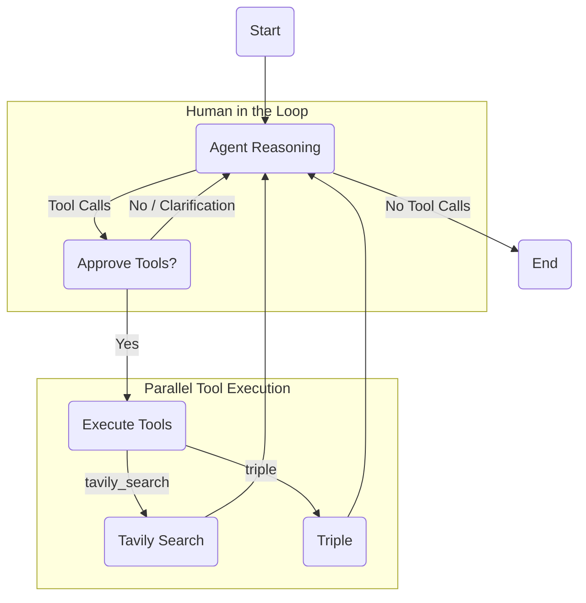

# ExecutorAgent using ReAct Design Pattern with LangGraph 🦜🕸️

An advanced AI agent that can reason about its actions and execute tools in a controlled flow, following the ReAct pattern with LangGraph's graph-based architecture. This implementation supports parallel execution of tools, human-in-the-loop for verification, and persistent memory.



## Features

- **ReAct Pattern Implementation**: Builds an agent that can reason about tasks and then act on that reasoning.
- **Parallel Tool Execution**: The agent can decide to call multiple tools at once, and the graph will execute them in parallel for improved efficiency.
- **Human in the Loop (HITL)**: Before executing tools, the graph pauses and waits for human approval. This allows for verification and redirection of the agent's actions.
- **Persistent Memory**: Conversation state is persisted using `AsyncSqliteSaver`, allowing the session to be resumed.

## How it Works

### 1. Agent Reasoning
The agent receives the user's prompt and decides whether to respond directly or to use one or more of its available tools.

### 2. Human in the Loop
If the agent decides to use tools, the execution is paused. The user is prompted in the command line to approve the tool execution.
-   Type `y` to allow the agent to proceed.
-   Type `n` to terminate the session.
-   Type any other text to provide feedback or clarification. The agent will take this new input into account and re-evaluate its plan.

### 3. Parallel Tool Execution
If the user approves, the selected tools are executed in parallel. This is achieved by dynamically branching the graph to the nodes representing the chosen tools.

### 4. Back to Reasoning
The results of the tool executions are returned to the agent, which then uses this new information to formulate a final response or decide on the next steps.

## Environment Variables

Add the following environment variables to your `.env` file:

```bash
GEMINI_API_KEY=your_gemini_api_key_here
TAVILY_API_KEY=your_tavily_api_key_here  # If using Tavily for search
LANGCHAIN_API_KEY=your_langchain_api_key_here  # Optional, for tracing
LANGCHAIN_TRACING_V2=true                      # Optional
LANGCHAIN_PROJECT=react agent                  # Optional
```

> **Important Note**: If you enable tracing by setting `LANGCHAIN_TRACING_V2=true`, you must have a valid LangSmith API key set in `LANGCHAIN_API_KEY`. Without a valid API key, the application will throw an error.

## Getting Started

Clone the repository:

```bash
git clone https://github.com/rosiefaulkner/agent-executor.git
cd agent-executor
```

Install dependencies using Poetry:

```bash
poetry install
```

Run the application:

```bash
poetry run python main.py
```

## Acknowledgements

This project builds upon:
- [LangGraph](https://langchain-ai.github.io/langgraph/) for agent control flow
- [LangChain](https://github.com/langchain-ai/langchain) for LLM interactions
- [ReAct Pattern](https://arxiv.org/abs/2210.03629) for agent reasoning methodology
