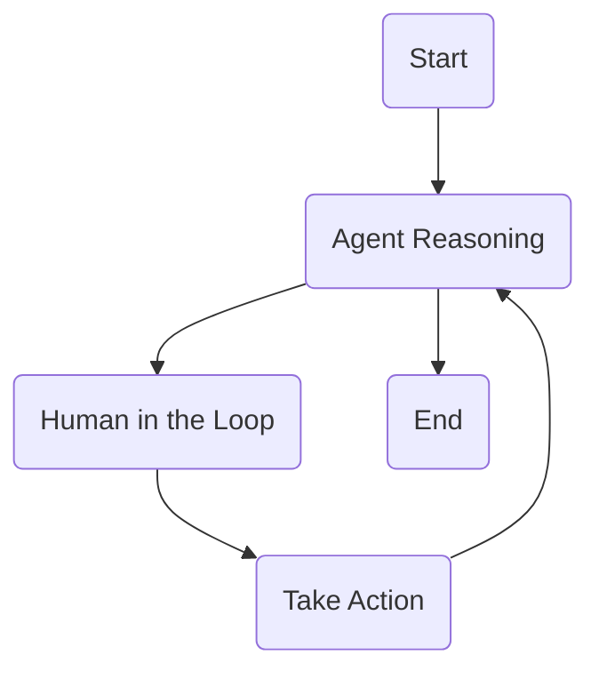

# ExecutorAgent using ReAct Design Pattern with LangGraph 🦜🕸️

An advanced AI agent that can reason about its actions and execute tools in a controlled flow, following the ReAct pattern with LangGraph's  graph-based architecture.



## Implementation Details

- **ReAct Pattern Implementation**: Builds an agent that can reason about tasks and then act on that reasoning
- **Graph-Based Control Flow**: Uses LangGraph to create sophisticated control flows for AI agents
- **Tool Integration**: Builds tools that enable operations / interactions with other services (e.g. web search, RAG search via vector store, etc.)
- **State Management**: Implements proper state handling for complex agent behavior

## Human in the Loop

This agent incorporates a human-in-the-loop (HITL) mechanism for enhanced control and collaboration. This feature allows you to guide and approve the agent's actions before they are taken.

### How it Works

1.  **Action Approval**: When the agent decides to use a tool, the execution is paused. You will be prompted in the command line to approve the tool execution.
    -   Type `y` to allow the agent to proceed with the tool call.
    -   Type any other text to provide feedback or clarification to the agent. The agent will take your input into account for its next step.

2.  **Clarification**: If the agent cannot proceed or has finished its task, it will ask for what you'd like next. This gives you an opportunity to provide a new prompt or guide the agent's next action.

## Structure

1. **Project Setup**:
   - Adds repository structure and environment configuration
   - Initialize project with main application file and Poetry configuration
   - Add dependencies for LangChain, LangGraph, and dotenv support

2. **ReAct Implementation**:
   - Builds the core agent functionality
   - Create react.py for ReAct agent implementation 
   - Add tools and prompt integration

3. **State Management**:
   - Creates state tracking for the agent
   - Adds AgentState class to state.py
   - Implements state management for agent actions and outcomes

4. **Agent Nodes**:
   - Sets up graph
   - Adds nodes.py to implement agent reasoning
   - Creates tool execution logic components

5. **Graph Construction**:
   - Adds graph generation functionality to main.py
   - Updates model in react.py for full integration

## Environment Variables

Add the following environment variables to your .env file:

```bash
GEMINI_API_KEY=your_gemini_api_key_here
TAVILY_API_KEY=your_tavily_api_key_here  # If using Tavily for search
LANGCHAIN_API_KEY=your_langchain_api_key_here  # Optional, for tracing
LANGCHAIN_TRACING_V2=true                      # Optional
LANGCHAIN_PROJECT=react agent                  # Optional
```

> **Important Note**: If you enable tracing by setting `LANGCHAIN_TRACING_V2=true`, you must have a valid LangSmith API key set in `LANGCHAIN_API_KEY`. Without a valid API key, the application will throw an error.

## Getting Started

Clone the repository:

```bash
git clone https://github.com/rosiefaulkner/agent-executor.git
cd agent-executor
```

Install dependencies:

```bash
poetry install
```


## Acknowledgements

This project builds upon:
- [LangGraph](https://langchain-ai.github.io/langgraph/) for agent control flow
- [LangChain](https://github.com/langchain-ai/langchain) for LLM interactions
- [ReAct Pattern](https://arxiv.org/abs/2210.03629) for agent reasoning methodology


